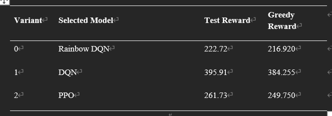

# CodingLab Deep Reinforcement Learning

This repository is the final course release combining the work of the three team members:

- **Ashley:** standard and CNN-based DQN implementations in `algorithms/dqn.py`.
- **dev_zhuang:** Rainbow DQN, the separated encoder/Q-head Rainbow variant, and autoencoder experiments.
- **Lejla:** PPO with behavioural-cloning warm start in `algorithms/ppo.py`.

The release intentionally keeps the original `main.py` training structure. Experiment logs, trained models, intermediate statistics and visualizations are not included.

## Project structure

```text
.
|-- main.py
|-- requirements.txt
|-- algorithms/
|   |-- dqn.py
|   |-- rainbow.py
|   |-- pretrained_model.py
|   `-- ppo.py
|-- environments/
|   |-- base_environment.py
|   `-- rainbow_cnn_environment.py
|-- autoencoder/
|   |-- autoencoder_model.py
|   `-- pretrain_autoencoder.py
`-- data/
    |-- variant_0/
    |-- variant_1/
    `-- variant_2/
```

`RainbowCNNEnvironment` is the final v11 environment from the Rainbow development line. It produces a `7 x 5 x 5` CNN observation containing agent position, load, remaining time, item presence, item lifetime, reachability and heuristic value.

`algorithms/rainbow.py` exposes only two training agents:

- `RainbowDQN`: the final end-to-end Rainbow CNN implementation, formerly called `DQN_v8`.
- `EncoderDecoderRainbowDQN`: the former `DQN_v11`, with a separate encoder and distributional Q head. It can load and optionally freeze a pretrained encoder.

## Create the virtual environment

Python 3.11 is recommended.

### Windows PowerShell

```powershell
python -m venv codinglab_drl
codinglab_drl\Scripts\Activate.ps1
python -m pip install --upgrade pip
pip install -r requirements.txt
```

### Linux or macOS

```bash
python3 -m venv codinglab_drl
source codinglab_drl/bin/activate
python -m pip install --upgrade pip
pip install -r requirements.txt
```

The generated `codinglab_drl/` directory is ignored by Git. It contains local dependencies only and must not be committed.

For a CUDA-enabled PyTorch installation, install the PyTorch build matching the local CUDA version before running `pip install -r requirements.txt`.

## Train

All training commands must be run while the `codinglab_drl` virtual environment is activated. If a new terminal is opened, activate it again before training:

```powershell
# Windows PowerShell
codinglab_drl\Scripts\Activate.ps1
```

```bash
# Linux or macOS
source codinglab_drl/bin/activate
```

After activation, all algorithms use `main.py` and the existing episode data under `data/variant_<n>`.

```powershell
# Ashley CNN-DQN
python main.py --algorithm dqn --variant 0 --num_episodes 10000

# Final Rainbow DQN
python main.py --algorithm rainbow --variant 0 --num_episodes 10000

# Rainbow with separate encoder and Q head
python main.py --algorithm rainbow_encoder --variant 0 --num_episodes 10000

# Lejla PPO
python main.py --algorithm ppo --variant 0 --num_episodes 10000
```

Variants `0`, `1` and `2` are supported. Change `--model_version` when repeating a run with the same configuration. Runtime checkpoints and TensorBoard files are written to `outputs/`, which is ignored by Git.

### Train with a pretrained encoder

First pretrain the autoencoder on the final Rainbow CNN environment:

```powershell
python -m autoencoder.pretrain_autoencoder --env_version 11 --variant 0
```

Then pass the saved encoder checkpoint to Rainbow:

```powershell
python main.py --algorithm rainbow_encoder --variant 0 --encoder_path PATH_TO_ENCODER.pt --freeze_encoder
```

Omit `--freeze_encoder` to fine-tune the encoder during Rainbow training.

## Final results

The selected model for each variant outperformed the greedy baseline on the final test set:

| Variant | Selected model | Test reward | Greedy reward |
|---:|---|---:|---:|
| 0 | Rainbow DQN | 222.72 | 216.920 |
| 1 | DQN | 395.91 | 384.255 |
| 2 | PPO | 261.73 | 249.750 |


